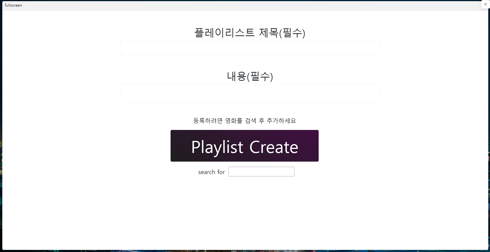
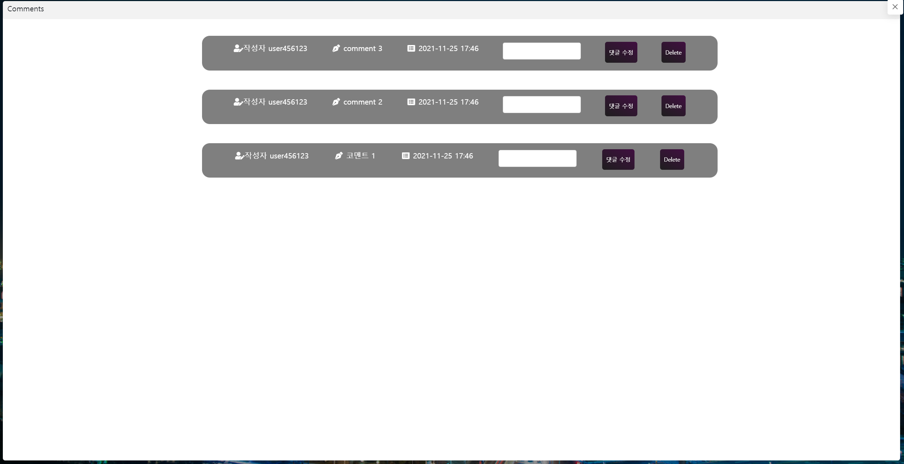

# SSAFY FINAL PROJECT - 나만의 웹 사이트 제작


## 1. 팀원 정보 및 업무 분담 내역

### 	1. 김병완 : Front-end 개발 / 디자인 및 CSS 총괄 관리

### 	2. 김성현 : Back-end 개발 / 모델 및 알고리즘 수립


## 2. 목표 서비스 구현 및 실제 구현 정도


### 	1. Login & Signup

#### 		1. Signup


#### 		2. Log in


<hr>
### 2. Main Page


<hr>

### 3. 영화 목록 페이지(Main) 및 Side Bar

#### 1. 메인 페이지


#### 2. Side Bar


<hr>

### 4. Profile / Playlist

#### 		1. Profile


#### 		2. Playlist 생성 페이지




#### 		3. Playlist 페이지


#### 		4. Playlist 세부 정보 페이지


<hr>

### 5. REVIEW / Comment 페이지


#### 		1. 단일 영화정보 페이지	


#### 		2. 리뷰 내역 페이지 및 상세 리뷰


#### 		3. 댓글 페이지 창



## 3. 데이터베이스 모델링(ERD)


## 4. 필수 기능에 대한 설명


### 1. Back-end

 - #### signup & Profile

    - ```python
      @api_view(['POST'])
      @permission_classes([AllowAny])
      def signup(request):
          password = request.data.get('password')
          password_confirmation = request.data.get('passwordConfirmation')
      
          if password != password_confirmation:
              return Response({'error' : '비밀번호가 일치하지 않습니다'}, status=status.HTTP_400_BAD_REQUEST)
          serializer = UserSerializer(data=request.data)
      
          if serializer.is_valid(raise_exception=True):
              user = serializer.save()
              user.set_password(request.data.get('password'))
      
              profile = Profile()
              profile.content = ''
              profile.genre = ''
              profile.user = user
              profile.save()
              return Response(serializer.data, status=status.HTTP_201_CREATED)
      
          return Response({'error': '회원정보가 저장되지 않았습니다'}, status=status.HTTP_503_SERVICE_UNAVAILABLE)
      ```

       -	처음에 기획했을 때는 Profile을 생성하는 함수를 따로 구현했었는데, 그렇게 할 경우 Front-end 단에서 따로 한번 더 함수를 호출해야 한다는 점이 번거롭게 느껴졌다.
       -	그래서 user가 정상적으로 생성된 경우, 새 profile instance를 생성하여 Profile 데이터를 초기화하여 자동으로 DB에 저장될 수 있도록 만들었다.

 - #### 영화 추천 알고리즘

    - ```python
      @api_view(['GET'])
      @permission_classes([AllowAny])
      def logincreaterecommendlist(request):
          movies = Movie.objects.all()
          Recommend.objects.all().delete()
          
          profile = Profile.objects.get(user_id=request.user)
          print('ter1')
          genres = profile.genre
          my_genres = list(genres.split('/'))
          print('ter2')
          for movie in movies:
              str_object = movie.genre_code[2:-2]       
              dbmovie_genrelist = (str_object.split("', '"))
              cnt = 0
              for genre in my_genres:
                  for genre_code in dbmovie_genrelist:
                      if genre == genre_code:
                          cnt += 1
              
              if cnt >= 1:
                  recommend = Recommend()
                  try:
                      recommend.title = movie.title
                  except:
                      recommend.title = 'Unknown_title'
                  try:
                      recommend.movie_pk = movie.auto_increment_id
                  except:
                      continue
                  try:
                      recommend.overview = movie.overview
                  except:
                      recommend.overview = 'Unknown_overview'
                  try:
                      recommend.poster_path = movie.poster_path
                  except:
                      recommend.poster_path = 'Unknown_poster_path'
                  try:
                      recommend.user_rating = movie.user_rating
                  except:
                      recommend.user_rating = 0
                  try:
                      recommend.release_date = movie.release_date
                  except:
                      recommend.release_date = '2000-01-01'
                  try:
                      recommend.priority = cnt
                  except:
                      recommend.priority = 0
                  try:
                      recommend.save()
                  except:
                      print(recommend)
          movies = Recommend.objects.all().order_by('-priority', '-user_rating')[:30]
          if len(movies) > 10:
              serializer = RecommendSerializer(movies, many=True)
              return Response(serializer.data, status=status.HTTP_202_ACCEPTED)
          else:
              Recommend.objects.all().delete()
              movies = Movie.objects.all().order_by('-user_rating')[:30]
      
              for movie in movies:
                  recommend = Recommend()
                  recommend.title = movie.title
                  recommend.movie_pk = movie.auto_increment_id
                  recommend.overview = movie.overview
                  recommend.poster_path = movie.poster_path
                  recommend.release_date = movie.release_date
                  recommend.user_rating = movie.user_rating
                  recommend.priority = 0
                  recommend.save()
      
              recommends = Recommend.objects.all()
              serializer = RecommendSerializer(recommends, many=True)
              return Response(serializer.data, status=status.HTTP_202_ACCEPTED)
          
          
      @api_view(['GET'])
      @permission_classes([AllowAny])
      def logoutcreaterecommendlist(request):
          Recommend.objects.all().delete()
          movies = Movie.objects.all().order_by('-user_rating')[:30]
      
          for movie in movies:
              recommend = Recommend()
              recommend.title = movie.title
              recommend.movie_pk = movie.auto_increment_id
              recommend.overview = movie.overview
              recommend.poster_path = movie.poster_path
              recommend.release_date = movie.release_date
              recommend.user_rating = movie.user_rating
              recommend.priority = 0
              recommend.save()
      
          recommends = Recommend.objects.all()
          serializer = RecommendSerializer(recommends, many=True)
          return Response(serializer.data, status=status.HTTP_202_ACCEPTED)
      ```

      	-	추천 영화 알고리즘이 가장 어려움을 많이 겪었던 부분이었다. 먼저 로그인 했을 때와, 로그인하지 않았을 때의 두 가지 경우의 수가 있으며, 로그인 했을 때는 선호하는 장르가 있을 경우와 없을 경우 두 가지 경우를 나누어서 추천 영화 정보를 데이터로 리턴해주어야 했다.
      	-	또한 다수의 영화 데이터를 반환해 주어야 하기 때문에, Recommend라는 새로운 모델을 작성하였으며, 필요한 정보를 movie Model에서 추출하는 과정에서 tmdb 데이터가 완전하지 않은 경우가 있었기에 try-except 구문을 이용하여 불량 데이터에 대한 처리를 수행하였다.

-	#### 유저 플레이리스트 관련 CRUD

  -	```python
    @api_view(['GET'])
    @permission_classes([AllowAny])
    def get_userplaylist(request):
        if request.method == 'GET':
            alluser = User.objects.all()
            serializer = {}
            for user in alluser:
                try:
                    query = Userplaylist.objects.filter(user_id=user.pk)
                    serializer[str(user.username)] = [query[0].p_title, query[0].p_content]
                    movie_id_list = []
                    for q in query:
                        movie_id_list.append(q.movie_id)
                    serializer[str(user.username)].append(movie_id_list)
                except:
                    pass
            return Response(serializer)
    
    @api_view(['GET'])
    @permission_classes([AllowAny])
    def userplaylist_get_movies(request, movielist):
    
        movielist = list(movielist.split('-'))    
        
        serializer = {}
        i = 0
        for movie_pk in movielist:
            i += 1
            movie = Movie.objects.get(auto_increment_id = movie_pk)
            serializer[f'movie{i}'] = MovieSerializer(movie).data
        return Response(serializer, status=status.HTTP_200_OK)
        
    @api_view(['POST'])
    @authentication_classes([JSONWebTokenAuthentication])
    @permission_classes([IsAuthenticated])
    def add_userplaylist(request):
        if request.method =='POST':
            #Userplaylist.objects.filter(user=request.user).delete()
    
            exist_title_list = []
            if Userplaylist.objects.filter(user=request.user).exists():
                user_playlist = Userplaylist.objects.filter(user=request.user)
                for movie in user_playlist:
                    exist_title_list.append(movie.movie_title)
            
            for movie_title in request.data['introduce']['movielist']:
                print(movie_title)
                movie = Movie.objects.filter(title=movie_title)[0]
                if not  movie.title in exist_title_list: 
                    playlist = Userplaylist()
                    playlist.user = request.user
                    playlist.movie = movie
                    playlist.movie_title = movie.title
                    playlist.p_title = request.data['introduce']['title']
                    playlist.p_content = request.data['introduce']['content']
                    playlist.poster_path = movie.poster_path
                    playlist.overview = movie.overview
                    playlist.save()
            
            playlist = Userplaylist.objects.filter(user=request.user)
            serializer = UserplaylistSerializer(playlist, many=True)
            return Response(serializer.data, status=status.HTTP_201_CREATED)
    
    @api_view(['PUT', 'DELETE'])
    @authentication_classes([JSONWebTokenAuthentication])
    @permission_classes([IsAuthenticated])
    def userplaylist_update_delete(request, user_pk, movie_pk):
        playlist = get_object_or_404(Userplaylist, user = user_pk, movie = movie_pk)
    
        if request.user == playlist.user:
            if request.method == 'DELETE':
                playlist.delete()
                data = {
                    'delete' : f'{playlist.pk}번 리스트가 삭제되었습니다.'
                }
                return Response(data, status=status.HTTP_204_NO_CONTENT)
            
            elif request.method == 'PUT':
                serializer = ReviewSerializer(playlist, data=request.data)
                if serializer.is_valid(raise_exception=True):
                    serializer.save()
                    return Response(serializer.data)
        return Response({'Unauthorized': '권한이 없습니다'}, status=status.HTTP_403_FORBIDDEN)
    ```

    -	플레이리스트 관련 crud를 구현하는 과정에서 있었던 어려움은 Front-end에서 원하는 데이터 형태를 직접 serialize하여 주어야 했다는 점이다.
    -	또 다른 어려움은 기존에 저장해 두었던 플레이리스트에서 새로운 정보가 추가되었을 때, 기존의 데이터를 추가하여 중복되는 현상이 있었다.
      -	기존의 플레이리스트를 새로운 리스트 배열에 저장하여 이중 반복문을 사용하여 중복 여부를 조사하였다.


<hr> 

### 2. Front-end

- 메인 페이지, 시작페이지.

  ``` javascript
  methods: {
      goMovie: function () {
        this.$router.push({ name: 'Movie'})
      },
      goLogin: function () {
        this.$router.push({ name: 'Login'})
      },
      goSignup: function () {
        this.$router.push({ name: 'Signup'})
      }
    }
  ```

  ```vue
  <div class="logos">
      <i class="fas fa-home fa-2x fa-fw" @click="goMovie"></i>
      <i class="fas fa-plus fa-2x fa-fw" @click="goLogin"></i>
      <i class="fas fa-sign-in-alt fa-2x fa-fw" @click="goSignup"></i>
  </div>
  ```

  

  - 로그인과 회원가입, 로그인을 하지 않더라도 영화데이터를 접근할 수 있게끔 영화 목록창으로 이동할 수 있는 세 가지 버튼들을 구현했다.

- 추천영화와 영화 리스트를 볼 수 있는 영화 페이지

  ``` html
  <div class="movie-page">
      <div class="movie"></div>
        <div class="title">Movies</div>
        <div class="carousel">
          <hooper class="hooper" :itemsToShow="8" :progress="true">
            <slide v-for="(movie, index1) in movies" :key="index1" class="slide mx-3">
              <movie-list :movie="movie" class="movielist" >
              </movie-list>
            </slide>
          </hooper>
        </div>
  
        <h1 class="title">Recommends</h1>
        <div class="carousel">
          <hooper class="hooper" :itemsToShow="8" :progress="true">
            <slide v-for="(recommend, index2) in recommends" :key="index2" class="slide mx-3">
              <recommend-list  :recommend="recommend" class="recommendlist">
              </recommend-list>
            </slide>
          </hooper>
        </div>
    </div>
  ```

  ``` javascript
  import { mapGetters, mapState } from 'vuex'
  import { 
    Hooper, 
    Slide, 
    } from 'hooper'
  import MovieList from '@/components/MovieList.vue'
  import RecommendList from '@/components/RecommendList.vue'
  import 'hooper/dist/hooper.css'
  
  export default {
    name: 'Movie',
    components: {
      MovieList,
      RecommendList,
      Hooper,
      Slide,
    },
    data: function () {
      return {
        Path: "",
      }
    },
    methods: {
      getPosterPath: function (inputData) {
        this.Path = inputData
      },
      deletePosterPath: function () {
        this.Path = ''
      },
      
    },
  
    computed: {
      ...mapState(['movies', 'recommends']),
      ...mapGetters(['isLogin']),
      
    },
    created: function () {
      ...//
    },
  }
  ```

  - 캐러셀을 쓰기 위해서 부트스트랩을 이용했었지만 실시간으로 변경되거나 이미지를 받아와야 하는 vue에서는 적합하지 않아서 많이 고생했던 부분이다.

  - 캐러셀을 쓰기 위해서 hooper라는 툴을 사용하였고 이를 movies, recommends를 보여주기 위해 가로로 이동하는 모습을 구현하였다.

  - movies와 recommends를 store에 저장해놓고 다방면으로 접근할 수 있도록 만들어 놓았다. 

  - recommends는 backend부분에서 알고리즘을 만들어서 사용했고 frontend에서는 받아오기만 하였다.

  - movies와 recommends를 표현하기 위해 component로 각각 만들어서 사용했고 MovieList.vue, RecommandList.vue로 만들어서 영화 데이터를 하나하나 보여주도록 만들었다.

  - MovieList.vue

    ``` javascript
    export default {
      name: 'MovieList',
      data: function () {
        return {
          poster_path: '',
          short_overview: '',
          isOver: false,
        }
      },
      props: {
        movie: Object
      },
      methods: {
        getPoster: function () {
          this.poster_path = `https://image.tmdb.org/t/p/original${this.movie.poster_path}`
          return this.poster_path
        },
        cutOverview: function () {
          const shorten = this.movie.overview.slice(0, 101) + '...'
          this.short_overview = shorten
          return this.short_overview
        },
        goDetail: function () {
          this.$router.push({name:'Detail', params: {moviePk: this.movie.auto_increment_id}})
        },
      },
      watch: {
        isOver: function (newVal, oldVal) {
          if (newVal === true & oldVal === false) {
            this.$emit('movie-poster-pass', this.poster_path)
          } else if (newVal === false & oldVal === true) {
            this.$emit('movie-poster-return')
          }
        },
        
      },
      computed: {
        info: function () {
          if (this.isOver) {
            return { brightness: true }
          } else {
            return { brightness: false}
          }
        },
      }
    }
    ```

    ``` css
    <style>
    .brightness {
      -webkit-filter: brightness(0.30);
      filter: brightness(0.30);
    }
    img {
      max-width: 100%;
      height: auto;
    }
    .card-title {
      font-family: 'Gotham Black 500', sans-serif;
      font-size: 1.3rem;
    }
    .card-text {
      font-family: 'Gotham 400', sans-serif;
      font-size: 0.8rem;
    }
    </style>
    ```

    ``` html
    <template>
      <div>
        <div class="card bg-dark text-white" @click=goDetail() @mouseover="isOver=true" @mouseleave="isOver=false">
          
          <div class="card-img-overlay text-center" v-show="isOver">
            <h5 class="card-title my-4">{{ movie.title }}</h5>
            <p class="card-text">{{ cutOverview() }}</p>
          </div>
        </div>
      </div>
    </template>
    ```

    - 마우스를 올리면 포스터가 어두어지고 설명이 보이도록 만들었다. 
    - 포스터를 어두어지는 기능을 구현하기 위해서 많은 시간을 썼다. computed의 사용을 정확히 알지 못했던 탓에 힘들지 않을 수 있었던 구현을 많이 돌아갔었다.
    - 포스터는 따로 잘라서 호출할 수 있는 형태의 함수로 만들어 사용했다
    - 줄거리 역시 길어서 직접 slice를 사용해서 줄이도록 만들었다.
    - RecommendList도 마찬가지 형식으로 만들었다.

- 로그인, 로그아웃, 회원가입.

  - store/index.js

    ``` javascript
    import Vue from 'vue'
    import Vuex from 'vuex'
    import createPersistedState from 'vuex-persistedstate'
    import router from '@/router'
    
    Vue.use(Vuex)
    
    import axios from 'axios'
    import Swal from 'sweetalert2'
    
    export default new Vuex.Store({
      plugins: [
        createPersistedState(),
      ],
      state: {
        authToken: localStorage.getItem('jwt'),
        movies: [],
        myUsername: '',
        recommends: [],
      },
      mutations: {
        SET_AUTH_TOKEN: function (state, token) {
          state.authToken = token
          localStorage.setItem('jwt', token)
        },
        DELETE_AUTH_TOKEN: function (state) {
          localStorage.removeItem('jwt')
          state.authToken = null
        },
        GET_MOVIE_DATA: function (state, result) {
          state.movies = result
        },
        SET_MY_USERNAME: function (state, userName) {
          state.myUsername = userName
        },
        DELETE_MY_USERNAME: function(state) {
          state.myUsername = ''
        },
        GET_RECOMMEND_DATA: function (state, result) {
          state.recommends = result
        },
      },
      getters: {
        isLogin: function (state) {
          return state.authToken ? true : false 
        }
      },
      actions: {
        login: function ({ commit }, credentials) {
          axios({
            method: 'post',
            url: 'http://127.0.0.1:8000/accounts/api-token-auth/',
            data: credentials,
          })
            .then(res => {
              console.log(res.config.data.split('"')[3])
              commit('SET_MY_USERNAME', res.config.data.split('"')[3])
              commit('SET_AUTH_TOKEN', res.data.token)
              Swal.fire({
                position: 'top-end',
                icon: 'success',
                title: 'Welcome!',
                showConfirmButton: false,
                timer: 1500,
              })
              router.push({ name: 'Profile', params:{ username: res.config.data.split('"')[3] }})
            })
            .catch(err => {
              console.log(err)
            })
        },
        logout: function ({ commit }) {
          commit('DELETE_AUTH_TOKEN')
          commit('DELETE_MY_USERNAME')
          router.push({ name: 'Login' })
        },
        signup: function (context, credentials) {
          axios({
            method: 'post',
            url: 'http://127.0.0.1:8000/accounts/signup/',
            data: credentials,
          })
            .then((res) => {
              console.log(res)
              this.dispatch('login', credentials)
            })
            .catch(err => {
              console.log(err)
              Swal.fire({
                icon: 'error',
                title: 'Stop!',
                text: '등록된 이름입니다!.',
              })
            })
        },
        loadMovieData: function ({ commit }) {
          axios({
            method: 'get',
            url: 'http://127.0.0.1:8000/movies/loadmovielist/',
          })
            .then(res => {
              console.log(res)
              commit('GET_MOVIE_DATA', res.data)
            })
            .catch(err => {
              console.log(err)
            })
        },
        loginLoadRecommendData: function ({ commit }) {
          axios({
            method: 'get',
            url: 'http://127.0.0.1:8000/movies/loginrecommendmovielist/',
            headers: { Authorization: `JWT ${localStorage.getItem('jwt')}` },
          })
            .then(res => {
              console.log(res)
              commit('GET_RECOMMEND_DATA', res.data)
            })
            .catch(err => {
              console.log(err)
            })
        },
        logoutLoadRecommendData: function ({ commit }) {
          axios({
            method: 'get',
            url: 'http://127.0.0.1:8000/movies/logoutrecommendmovielist/'
          })
            .then(res => {
              console.log(res)
              commit('GET_RECOMMEND_DATA', res.data)
            })
            .catch(err => {
              console.log(err)
            })
          },
      },
      modules: {
      }
    })
    
    ```

  - 로그인, 로그아웃, 회원가입은 모두 store에 저장하고 구현하여 사용했다.

  - 경고창을 띄우기위해서 sweetalert2 툴을 사용했고 frontend에서 일차적으로 유효성 검사를 하고 넘기는 방식을 취했다

- 영화 상세정보를 조회하는 상세정보 페이지

  ``` javascript
  createReview: function () {
        const content = this.review_content
        axios({
          method: 'post',
          url: `http://127.0.0.1:8000/movies/review_create/${this.movieId}/`,
          headers: { Authorization: `JWT ${localStorage.getItem('jwt')}` },
          data: {
            content,
          }
        })
          .then(res => {
            this.reviews.unshift(res.data)
            this.review_content = ''
            Swal.fire({
              title: '리뷰가 등록되었습니다!',
              timer: 1000,
              timerProgressBar: true,
            })
          })
          .catch(err => {
            console.log(err)
          })
      },
      deleteReview: function (review) {
        const reviewPk = review.review_pk
        axios({
          method: 'delete',
          url: `http://127.0.0.1:8000/movies/review_update_delete/${this.movieId}/${reviewPk}/`,
          headers: { Authorization: `JWT ${localStorage.getItem('jwt')}` }
        })
         .then(() => {
          axios({
            method: 'get',
            url: `http://127.0.0.1:8000/movies/review_list/${this.$route.params.moviePk}/`
          })
            .then(res => {
              console.log(res)
              this.reviews = res.data
            })
         })
         .catch(err => {
           console.log(err)
         })
      },
      likeOrDislike: function () {
        axios({
            method: 'post',
            url: `http://127.0.0.1:8000/movies/movie_like/${this.movieId}/`,
            headers: { Authorization: `JWT ${localStorage.getItem('jwt')}` }
          })
            .then(res => {
              console.log(res.data)
              if (res.data.data === "like") {
                this.isLike = true
                this.numLike += 1
              } else {
                this.isLike = false
                this.numLike -= 1
              }
            })
            .catch(err => {
              console.log(err)
            })
      },
  
      goReviewDetail: function (review) {
        this.$router.push({ name: 'ReviewDetail', params: { reviewPk: review.review_pk, data: review } })
      },
  ```

  - 상세 정보로 줄 수 있는 모든 정보들을 주고 화면 중앙에 표시하였다
  - 관련된 리뷰들을 한번에 모아서 볼 수 있도록 창을 따로 만들었다.
  - 상세정보로 들어오는 루트는 영화정보 페이지에서 영화를 클릭하면 들어올 수 있도록 구현했다.

- 리뷰에 대한 자세한 내용을 보는 Review Detail 페이지

  ``` javascript
  components: {
      CommentItem,
    },
    data: function () {
      return {
        reviewId: '',
        reviewData: '',
        reviewContentModi: '',
        commentContent: '',
        comments: [],
        popupActivo2: false,
        popupActive: false,
      }      
    },
    methods: {
      updateReview: function () {
        const reviewItem = {
          ...this.reviewData,
          content: this.reviewContentModi,
        }
        axios({
          method: 'put',
          url: `http://127.0.0.1:8000/movies/review_update_delete/${this.reviewData.movie}/${this.reviewData.review_pk}/`,
          headers: { Authorization: `JWT ${localStorage.getItem('jwt')}` },
          data: {
            reviewItem,
          }
        })
          .then(res => {
            console.log(res)
            this.reviewData.content = this.reviewContentModi
            this.popupActivo2 = false
          })
          .catch(err => {
            console.log(err)
          })
      },
      createComment: function () {
        const content = this.commentContent
        axios({
          method: 'post',
          url: `http://127.0.0.1:8000/movies/commentlist_or_create/${this.reviewId}/`,
          headers: { Authorization: `JWT ${localStorage.getItem('jwt')}` },
          data: {
            content
          }
        })
          .then(() => {
            axios({
              method: 'get',
              url: `http://127.0.0.1:8000/movies/commentlist_or_create/${this.reviewId}/`,
              headers: { Authorization: `JWT ${localStorage.getItem('jwt')}` }
            })
              .then(res => {
                console.log(res)
                this.comments = res.data
              })
              .catch(err => {
                console.log(err)
              })
          })
          .catch(err => {
            console.log(err)
          })
      },
      commentChange: function (input) {
        this.comments = input
      }
    },
    created: function () {
      this.reviewId = this.$route.params.reviewPk
  
  
      axios({
        method: 'get',
        url: `http://127.0.0.1:8000/movies/commentlist_or_create/${this.reviewId}/`,
        headers: { Authorization: `JWT ${localStorage.getItem('jwt')}` }
      })
        .then(res => {
          console.log(res)
          this.comments = res.data
        })
        .catch(err => {
          console.log(err)
        })
        
      axios({
        method: 'get',
        url: `http://127.0.0.1:8000/movies/review_detail/${this.reviewId}/`,
        headers: { Authorization: `JWT ${localStorage.getItem('jwt')}` }
      })
        .then(res => {
          this.reviewData = res.data
          console.log(this.reviewData)
        })
        .catch(err => {
          console.log(err)
        })
    }
  ```

  - 들어오면 created hook으로 정보를 요청하여 받아와서 뿌려주는 형식으로 했으며 리뷰에 대한 댓글을 작성하고 리뷰를 수정할 수 있도록 만들었다.
  - 코멘트창과 수정창은 팝업창으로 만들어서 구현했다.

- Profile 페이지

  - 영화를 추천 받기 위한 장르 선택창을 구현해놓았고 자기소개를 할 수 있는 입력창을 만들어놓았다.
  - 플레이리스트는 개인당 한 개의 선호하는 리스트들을 만들 수 있는데 이를 위한 팝업창을 만들어놓았다.

- PlayList 페이지

  - 개인당 하나의 플레이리스트를 모두 볼 수 있는 페이지이다.
  - 게시글은 캐러셀을 이용하여 플레이리스트에 들어있는 이미지들을 자동으로 넘기며 보여주도록 만들었고 마우스 오버를 하면 작성자와 소개글을 볼 수 있도록 만들어 놓았다
  - 클릭하면 팝업창을 통해서 이 글을 볼 수 있도록 만들었으며 영화 정보들을 볼 수 있도록 카드형식으로 만들어서 제공한다.
  - 카드들을 클릭하면 영화 상세보기 페이지로 넘어갈 수 있다.
  - 게시글을 케러셀로 표현하기 위해서 movieList와 recommendList에서 사용했던 hooper 툴을 사용했다.
  - 캐러셀을 구현하는데 bootstrap을 사용하다가 active 속성을 따로 줄 수 없어서 매우 헤맸던 곳이고 적절하고 내가 쓸 수 있는 툴을 찾는 것도 또 많이 힘들었던 구현이었다.

  ``` javascript
  import axios from 'axios'
  import CarouselList from '@/components/CarouselList.vue'
  
  export default {
    name: 'PlayListItem',
  
    components: {
      CarouselList
    },
  
    data: function () {
      return {
        popupActivo4: false,
        movies: [],
        isOver: false,
      }
    },
  
    props: {
      playList: Array,
      index: String,
    },
  
    methods: {
      getMovies: function (movieids) {
        const ids = movieids.join('-')
        axios({
          method: 'get',
          url: `http://127.0.0.1:8000/movies/userplaylist/movies/${ids}/`,
          headers: { Authorization: `JWT ${localStorage.getItem('jwt')}` },
        })
          .then(res => {
            this.movies = res.data
          })
          .catch(err => {
            console.log(err)
          })
        this.popupActivo4=true
      },
      getPoster: function (movie) {
        const poster_path = `https://image.tmdb.org/t/p/original${movie.poster_path}`
        return poster_path
      },
      getGenre: function (gen) {
        let genres = gen.replace('[', '')
        genres = genres.replace(']', '')
        return genres
      },
      cutOverview: function (overview) {
        let shorten = ''
        if (overview.length >= 150) {
          shorten = overview.slice(0, 151) + '...'
          return shorten
        } else {
          return overview
        }
      },
      convertDate: function (time) {
        const tmp = time.split('-')
        const result = tmp.slice(0, 2).join('.')
        return result
      },
      goDetail: function (movie) {
        this.$router.push({ name:'Detail', params: { moviePk: movie.auto_increment_id } } )
      },
  
    },
    created: function () {
      const ids = this.playList[2].join('-')
        axios({
          method: 'get',
          url: `http://127.0.0.1:8000/movies/userplaylist/movies/${ids}/`,
          headers: { Authorization: `JWT ${localStorage.getItem('jwt')}` },
        })
          .then(res => {
            this.movies = res.data
          })
          .catch(err => {
            console.log(err)
          })
      
    },
    computed: {
      info: function () {
        if (this.isOver) {
          return { infomation: true }
        } else {
          return { infomation: false}
        }
      },
    }
  }
  ```

  - 한 개의 component를 이용하여 캐러셀들을 만들어 사진들을 보여줄 수 있게끔 하였다.

- App.vue

  ``` html
  <div class="back-container">
          
        </div>
  ```

  - 배경은 App.vue에 작성하여 노출할 수 있도록 하였다.

  ``` html
  <div class="row">
          <div id="parentx" class="container">
            <i class="sidebar-btn fas fa-arrow-circle-right fa-2x fixed-top p-4" @click="changeActive" style="color:white"></i>
            <vs-sidebar parent="body" default-index="1" color="primary" class="sidebarx" spacer v-model="active">
              <div class="header-sidebar ms-2 row" slot="header">
                <i class="fas fa-user fa-2x col-2"></i>
                <h4 class="col-1">{{ myUsername }}</h4>
              </div>
              <vs-sidebar-item index="1" class="row ms-1" :to="{ name: 'Movie'}" style="max-width: 95%;" @click="changeActive">
                <i class="fas fa-home fa-2x fa-fw col-1"></i>
                <div class="fs-6 col-1 offset-1" >
                  Movie
                </div> 
              </vs-sidebar-item>
              <div v-if="isLogin">
                <vs-sidebar-item index="2" class="row ms-1" :to="{ name: 'Playlist' }" style="max-width: 95%;" @click="changeActive">
                  <i class="fas fa-clipboard-list fa-2x fa-fw col-1"></i>
                  <div class="fs-6 col-1 offset-1">
                    PlayList
                  </div> 
                </vs-sidebar-item>
                <vs-divider icon="person" position="left">
                </vs-divider>
                <vs-sidebar-item index="3" class="row ms-1" :to="{ name: 'Profile', params: { username: myUsername }}" style="max-width: 95%;" @click="changeActive">
                  <i class="fas fa-id-badge fa-2x fa-fw col-1"></i>
                  <div class="fs-6 col-1 offset-1">
                    Profile
                  </div> 
                </vs-sidebar-item>
                <vs-sidebar-item index="4" class="row ms-1" @click.native="logout()" to="#" @click="changeActive" style="max-width: 95%;">
                  <i class="fas fa-sign-out-alt fa-2x fa-fw col-1"></i>
                  <div class="fs-6 col-1 offset-1">
                    logout
                  </div>
                </vs-sidebar-item>
              </div>
              <div v-else>
                <vs-sidebar-item index="2" class="row ms-1" :to="{ name: 'Signup' }" style="max-width: 95%;" @click="changeActive">
                  <i class="fas fa-plus fa-2x fa-fw col-1"></i>
                  <div class="fs-6 col-1 offset-1" >
                    Signup
                  </div>
                </vs-sidebar-item>
                <vs-sidebar-item index="3" class="row ms-1" :to="{ name: 'Login' }" style="max-width: 95%;" @click="changeActive">
                  <i class="fas fa-sign-in-alt fa-2x fa-fw col-1"></i>
                  <div class="fs-6 col-1 offset-1" >
                    Login
                  </div>
                </vs-sidebar-item>
              </div>
            </vs-sidebar>
          </div>
  ```

  - sidebar를 구현하여 영화 목록을 볼 수 있는 버튼는 모두 볼 수 있도록 하였고 로그인 되어있는 경우 프로필과 로그아웃,  플레이리스트를 이동할 수 있도록 버튼을 만들어놓았다. 로그인 되어있지 않은 경우 로그인, 회원가입을 할 수 있는 버튼을 볼 수 있게 만들었고 이동할 수 있도록 하였다.
  - 이곳에서 사용되는 함수들을 대부분 store/index.js를 가져와서 사용하는 방법을 택했다.

- Fronend를 구현하며 어려웠던 점
  - HTML/CSS를 설정함에 있어서 한 페이지에 html, CSS을 제어하는 것이 아닌 나눠져있고 각 파일마다 제공하는 환경과 상단 파일과의 연결을 생각하며 만들어야하는 부분이 굉장히 힘들었다
  - CSS/HTML의 상속관계를 직접적으로 그려지지 않아서 하나하나 찍어가며 제작하는 것이 시간이 꽤 걸려서 타임 컨트롤이 힘들었다.
  - Server와의 통신에서 오류를 접하게 되면 Server에서 문제가 생긴 것과 Client의 요청이 잘못된 것이 구분이 되기도 하지만 일부분은 구분이 정확히 되지 않아서 페어와 고심하여 Debugging을 했다.
  - Vue에서 작동하는 속성들과 기존에 자주 사용하던  bootstrap과 같은 툴과 연동이 크게 좋지 않아서 원하는 기능을 구현하기 위해서 따로 툴을 찾거나 자료를 찾는 것들이 어려웠다.
  - Vue 툴들을 찾아서 하나하나 공식문서와 대조해가며 해결하는 부분들이 재미도 있었지만 타임컨트롤에 많은 제약을 주는 요소였다.

